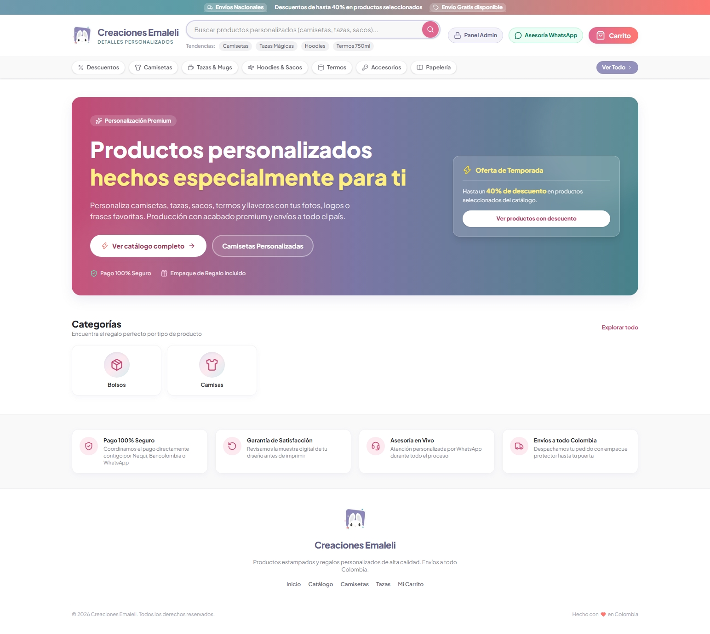
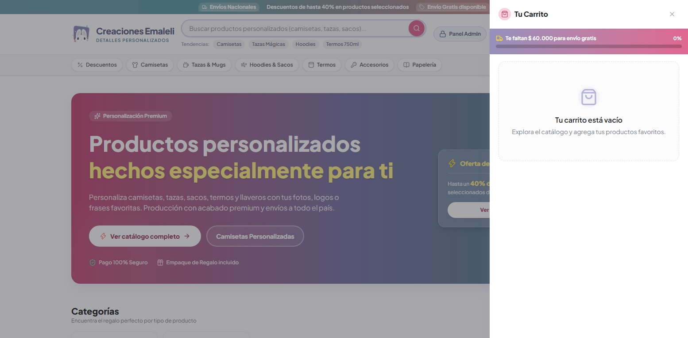
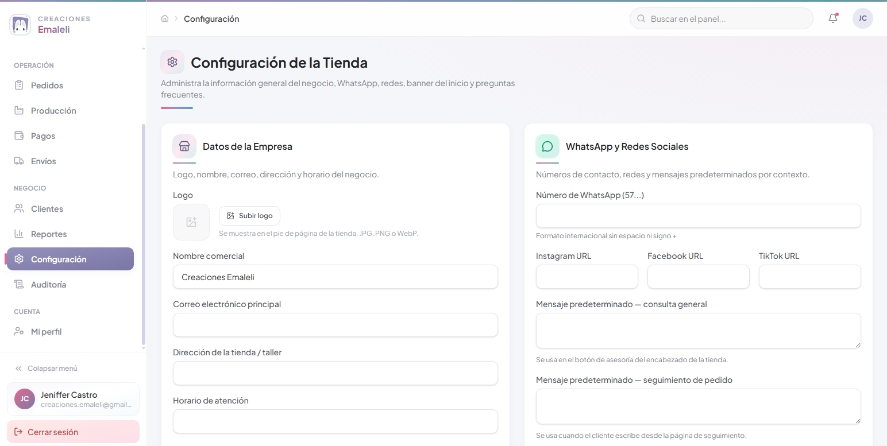
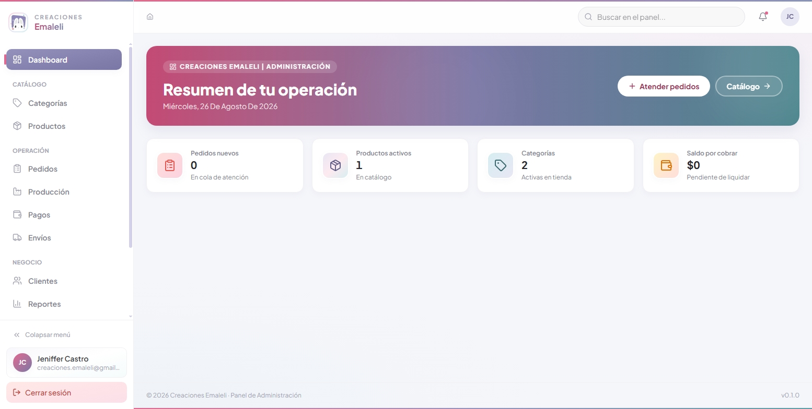

<div align="center">

<picture>
  <source media="(prefers-color-scheme: dark)" srcset="docs/readme_assets/creaciones-emaleli.svg">
  <source media="(prefers-color-scheme: light)" srcset="docs/readme_assets/creaciones-emaleli.svg">
  
</picture>

<p align="center">
  <strong>e-commerce platform for personalized products. Custom t-shirts, mugs, tumblers and more, made to order</strong>
</p>

<p align="center">
  <a href="https://creaciones-emaleli.vercel.app/" target="_blank">Take a look!</a>
</p>


<p align="justify">
CREACIONES EMALELI is a custom e-commerce platform, inspired by business models such as Temu, Shein, and AliExpress, designed for the sale of customizable products. It allows users to manage the entire catalog, enable customer customization of each product, track orders from purchase to delivery, and oversee internal production and payments.<br> The solution is designed for businesses that manufacture and sell custom products and need to centralize their catalog, automate the ordering process, and provide visibility into production status for both the internal team and the end customer.
</p>

|                                                            |                                                              |
| ---------------------------------------------------------- | ------------------------------------------------------------ |
| - Catalog with product variants and customization options. | - Persistent shopping cart with real-time price calculation. |
| - Checkout with shipping and confirmation via WhatsApp.    | - Order management with statuses and a timeline.             |
| - Production tracking visible to the customer.             | - Control over payments, shipping, reports, and SEO.         |

</div>



---

## Objective

The objective of CREACIONES EMALELI is to offer a comprehensive online store that allows customers to customize their products and track their orders transparently, while the team manages the catalog, production, payments, and shipping from a single dashboard.

---

## Catalog Module

<table>
<tr>
<td width="33%" valign="top">
<h3>📂 Categories</h3>

- Full CRUD for categories
- Category image upload
- Sort order field (drag & drop or numeric input)
- Enable/disable category (hidden in the public store if inactive)
- Unique slug validation

</td>
<td width="33%" valign="top">
<h3>📦 Products</h3>

- Full product CRUD
- Automatic slug generation (editable) and uniqueness validation
- Base price (and optional discounted price)
- Short and long descriptions (rich text)
- Basic SEO: title, meta description, OG image
- Product status (active/inactive/out of stock)
- Estimated production time (days) visible in the store
- Product–category association (one or more)

</td>
<td width="33%" valign="top">
<h3>🖼️ Gallery</h3>

- Upload multiple images per product
- Select a featured image
- Reorder images (drag & drop)
- Delete individual images
- Optimization/resizing upon upload

</td>
</tr>
<tr>
<td width="33%" valign="top">
<h3>🎨 Variants</h3>

- Variant model per product (size, color, material)
- Variant combinations (size × color matrix, with differentiated stock/price if applicable)
- Enable/disable specific variants
- Image associated with each variant (optional, e.g., by color)

</td>
<td width="33%" valign="top">
<h3>✏️ Customizations</h3>

- Custom field builder for each product
- Supported types: Text, Number, Color, File, List, Checkbox
- Required/optional field settings
- Validation rules by type (maximum length, file formats, numerical range)
- Additional price per customization option (if applicable)
- Field display order

</td>
<td width="33%" valign="top">
</td>
</tr>
</table>

---

## Public Store

<table>
<tr>
<td width="33%" valign="top">
<h3>🏠 Home</h3>

- Main hero (featured banner, CTA)
- Featured products section
- Categories section (navigable grid)
- Customer Testimonials Section
- Frequently Asked Questions (FAQ) Section

</td>
<td width="33%" valign="top">
<h3>🗂️ Catalog</h3>

- Product List with Pagination/Infinite Scroll
- Search by Name/Keyword
- Filters (category, price, available variants)
- Sorting (price asc/desc, newest, best sellers)
- Empty status when no results are found

</td>
<td width="33%" valign="top">
<h3>🛒 Product</h3>

- Image gallery with zoom/carousel
- Variant selector with price/image updates
- Dynamic customization form based on field type
- Real-time total price calculation (base price + variants + customizations)
- Related products section
- Estimated production time indicator

</td>
</tr>
</table>

---

## Shopping Cart

<table>
<tr>
<td width="33%" valign="top">
<h3>🛍️ Shopping Cart</h3>

- Add a product (with variants and customization) to the shopping cart
- Edit a shopping cart item (quantity, variant, or customization)
- Remove item from cart
- Quantity control (increase/decrease, minimum validation)

</td>
<td width="33%" valign="top">
<h3>💾 Persistence</h3>

- Persistence in LocalStorage (guest cart)
- Additional persistence in cookies if SSR of the cart state is required
- Synchronization across browser tabs
- Expiration/cleaning of old carts

</td>
<td width="33%" valign="top">
<h3>🧾 Summary</h3>

- Subtotal calculation per item
- Grand total calculation
- Aggregated estimated delivery/production time (based on the slowest item)
- Sidebar cart view (drawer) and full-page view

</td>
</tr>
</table>



---

## Checkout

<table>
<tr>
<td width="25%" valign="top">
<h3>👤 Customer Information</h3>

- Full Name
- WhatsApp Number (with format validation)
- City
- Email
- Company (optional, for corporate orders)

</td>
<td width="25%" valign="top">
<h3>📋 Order Details</h3>

- General comments field
- Attach reference files (logos, designs)
- Final confirmation of customizations selected per item

</td>
<td width="25%" valign="top">
<h3>🚚 Shipping</h3>

- Shipping method selection: In-store pickup, Home delivery, Carrier
- Conditional form based on selected method
- Shipping cost calculation (if applicable, based on city/carrier)

</td>
<td width="25%" valign="top">
<h3>✅ Confirmation</h3>

- Automatic order creation (order + items + files)
- Generation of a unique order code (e.g., EML-2026-0001)
- Confirmation screen with order summary
- Button to open WhatsApp with a pre-filled message
- Sending a confirmation email (optional)
- Empty cart after successful confirmation

</td>
</tr>
</table>

---

## Order Management

<table>
<tr>
<td width="25%" valign="top">
<h3>📊 Dashboard</h3>

- “New” orders view
- “In production” orders view
- “Shipped” orders view
- Kanban view (optional) by status
- Filters by date, city, state, and customer

</td>
<td width="25%" valign="top">
<h3>🔍 Details</h3>

- Customer information
- List of products/items with variants and customizations
- Associated payment history
- Attachments (customer and production)
- Complete event history/timeline

</td>
<td width="25%" valign="top">
<h3>🔄 Statuses</h3>

New → Under Review → Waiting for Customer → Design Approved → Production → Packing → Shipped → Delivered

- Validation of allowed transitions (state machine)
- Client notification for key status changes

</td>
<td width="25%" valign="top">
<h3>🕒 Timeline</h3>

- Automatic event logging (status, payments, messages, files)
- Log of the user/admin responsible for the event
- Chronological view in the order details

</td>
</tr>
</table>

---

## Production

> Provides visibility into the production process for the team and the client.

<table>
<tr>
<td width="33%" valign="top">
<h3>📸 Updates</h3>

- Upload progress photos
- Upload progress videos
- Internal comments and comments visible to the client

</td>
<td width="33%" valign="top">
<h3>🔁 Change Requests</h3>

- Create a change request (from admin or generated by the client)
- Record the client’s response (approve/reject/comment)
- Close the request with a final status

</td>
<td width="33%" valign="top">
<h3>👁️ Tracking</h3>

- Public tracking view via a unique link (non-guessable token)
- Current status, summary timeline, and production updates
- No authentication required for the client

</td>
</tr>
</table>

---

## Payments

<table>
<tr>
<td width="20%" valign="top">
<h3>💵 Advance Payments</h3>

- Record an advance payment (amount, date, payment method)

</td>
<td width="20%" valign="top">
<h3>➕ Partial Payments</h3>

- Record additional partial payments
- Automatic calculation of outstanding balance

</td>
<td width="20%" valign="top">
<h3>✔️ Final Payment</h3>

- Record final payment
- Verify that the total paid matches the order total

</td>
<td width="20%" valign="top">
<h3>🧾 Receipts</h3>

- Upload payment receipt (image/PDF)
- Link the receipt to each recorded payment

</td>
<td width="20%" valign="top">
<h3>📄 Billing</h3>

- Upload invoice PDF
- Billing status (pending, issued, canceled)

</td>
</tr>
</table>

---

## Shipping

<table>
<tr>
<td width="33%" valign="top">
<h3>🚛 Shipping Methods</h3>

- In-store pickup
- Home delivery
- Carrier

</td>
<td width="33%" valign="top">
<h3>📍 Shipping Information</h3>

- Address
- City
- Recipient
- ID (if applicable, depending on the carrier)
- Contact phone number

</td>
<td width="33%" valign="top">
<h3>🏷️ Tracking Information</h3>

- Tracking number
- Tracking status (generated, in transit, delivered, returned)
- Shipment/delivery date
- External tracking link (if provided by the carrier)

</td>
</tr>
</table>

---

## Settings

<table>
<tr>
<td width="25%" valign="top">
<h3>🏢 Company</h3>

- Logo
- Name
- Address
- Business Hours

</td>
<td width="25%" valign="top">
<h3>📱 Social Media</h3>

- Facebook
- Instagram
- TikTok

</td>
<td width="25%" valign="top">
<h3>💬 WhatsApp</h3>

- Primary Contact Number
- Predefined messages (general inquiry, order tracking, checkout confirmation)

</td>
<td width="25%" valign="top">
<h3>🌐 Public Page</h3>

- Home page banner management
- Frequently Asked Questions (FAQ) management
- Contact information visible on the site

</td>
</tr>
</table>



---

## Dashboard and Reports

<table>
<tr>
<td width="25%" valign="top">
<h3>📈 Sales</h3>

- Reports by day, month, and year
- Comparative trend charts

</td>
<td width="25%" valign="top">
<h3>📦 Products</h3>

- Best-selling / Least-selling
- Filter by date range and category

</td>
<td width="25%" valign="top">
<h3>🧾 Orders</h3>

- Orders by status
- Orders by city
- Average time per process stage

</td>
<td width="25%" valign="top">
<h3>👥 Customers</h3>

- Frequent customers (highest number of orders/total amount)
- New customers during the period
- Export reports (CSV/Excel)

</td>
</tr>
</table>



---

## Optimization

> Prepare the system for production at scale and securely.

<table>
<tr>
<td width="33%" valign="top">
<h3>🔎 SEO</h3>

- Dynamic metadata per page (title, description, OG, Twitter cards)
- Sitemap.xml generation
- robots.txt configuration
- Structured data (JSON-LD) for products

</td>
<td width="33%" valign="top">
<h3>⚡ Performance</h3>

- Lazy loading of images and heavy components
- Image optimization (modern formats, responsive sizes)
- Caching strategy (ISR/SSG where applicable, cache for frequent queries)
- Bundle analysis and code splitting

</td>
<td width="33%" valign="top">
<h3>🔒 Security</h3>

- Rate limiting on public endpoints (checkout, forms, login)
- Thorough input validation (server-side, using Zod)
- Data sanitization (XSS/injection prevention)
- Audit of administrative actions
- Review of security headers (CSP, HSTS, etc.)

</td>
</tr>
</table>

---

## Tools Used

      

---

## System Architecture

```bash
emaleli → Frontend/Backend (Next.js) → Prisma → Supabase (PostgreSQL) → Dashboard
```

---

## Quick Install

```bash
git clone https://github.com/emilymontec/creaciones-emaleli.git; cd creaciones-emaleli
```

<sub> clone the repository </sub>

### Install dependencies

```bash
pnpm install
```

### Environment variables

```bash
DATABASE_URL=SUPABASE_DB_URL
DIRECT_URL=SUPABASE_DIRECT_URL
NEXTAUTH_SECRET=NEXTAUTH_SECRET
NEXTAUTH_URL=http://localhost:3000
SUPABASE_URL=SUPABASE_URL
SUPABASE_ANON_KEY=SUPABASE_ANON_KEY
WHATSAPP_NUMBER=WHATSAPP_NUMBER
```

<sub> create the `.env` file and configure the environment variables </sub>

### Database configuration

```bash
npx prisma generate
npx prisma migrate dev
```

### Run the application

```bash
pnpm run dev
```

<sub> Application available at: http://localhost:3000 </sub>

---

## File Structure

```bash
creaciones-emaleli/
│
├── backend/
│   ├── api/
│   ├── lib/
│   └── services/
│
├── frontend/
│   ├── app/
│   ├── components/
│   └── styles/
│
├── prisma/
│   ├── schema.prisma
│   └── migrations/
│
├── public/
├── package.json
├── tsconfig.json
├── .env
└── README.md
```

---

## Contributing

### Fork repository

**Create branch**

```bash
git checkout -b feature/my-feature
```

**Commit changes**

```bash
git commit -m "Add new feature"
```

**Push changes**

```bash
git push origin feature/my-feature
```

Open a Pull Request describing the proposed changes.

---

## Author

**Emily Monterrosa Castro - Full Stack Developer** <br>
[GitHub](https://github.com/emilymontec) · [LinkedIn](https://www.linkedin.com/in/emilymontec/) · [Portfolio](https://emilymontec.github.io/portfolio/)

---

## License

MIT License.

See the [LICENSE](LICENSE) file for additional information.

---

<!--
## Appendices
See the [UserGuide](docs/MANUAL%20USUARIO%20KEISY%20MEDICAL.pdf) to learn more.

If you want to know more about the system, please check the [Documentation](docs/DOCUMENTACION%20TECNICA%20KEISY%20MEDICAL.pdf).
-->
