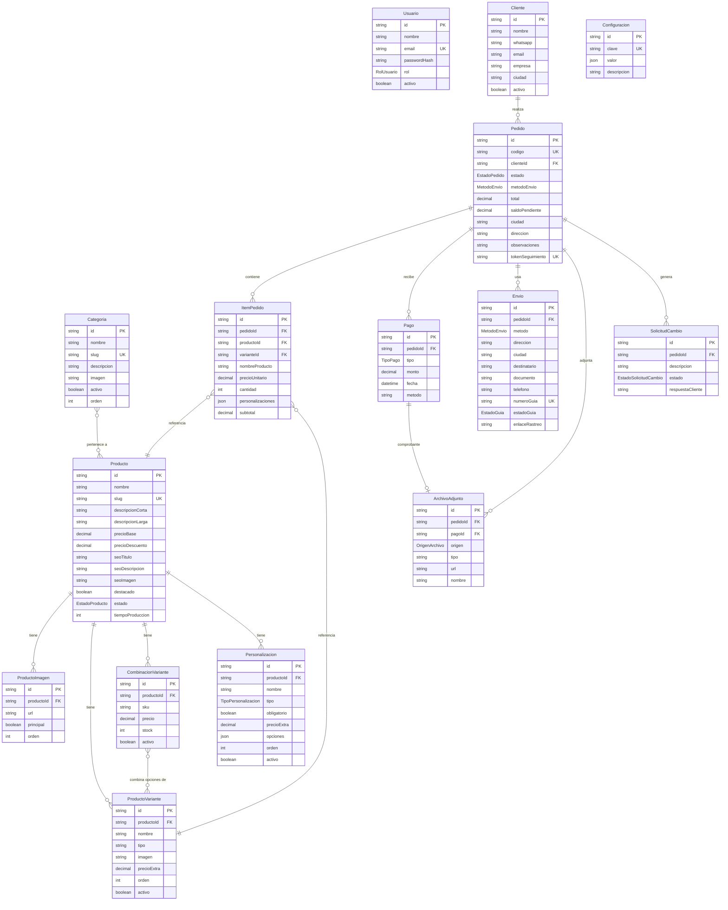

# Diagrama Entidad-Relación — Creaciones Emaleli

Notas:

- `Categoria`–`Producto` es N-N (un producto puede estar en varias categorías).
- `ItemPedido` guarda un snapshot (`nombreProducto`, `precioUnitario`) para preservar el pedido aunque el producto cambie o se elimine.
- `Pedido.tokenSeguimiento` es único y no adivinable (seguimiento público de la Fase 8).
- `ArchivoAdjunto` es 1-1 con `Pago` cuando funciona como comprobante.
